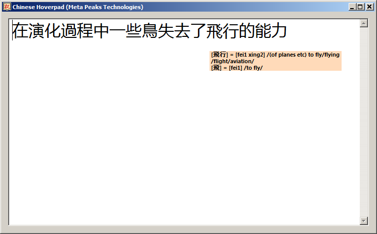

# Hoverpad
Mandarin Chinese notepad that provides mouse-over functionality with instant translations, and the ability to convert between traditional and simplified.

# Attribution

[CC-CEDICT](https://www.mdbg.net/chinese/dictionary?page=cedict) is used as the dictionary file for lookups.